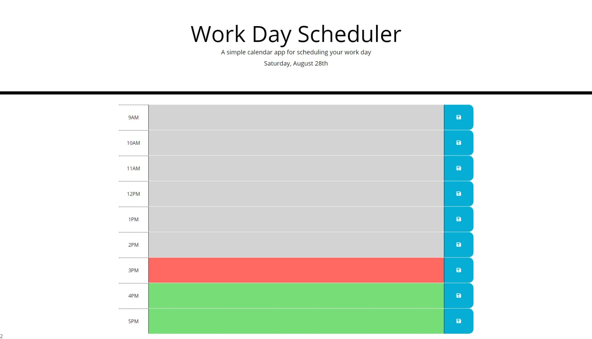

## Work Scheduler

## Purpose
A website that allows you to plan your workday accordingly, with each hour of the workday being editable to place what task you need to get done.

## Preview

## Built With
* HTML
* CSS
* JavaScript
  
## Usage
To start you, need to choose a time of day that you would like to add a task to then write what objective you would like to get done during that time.

## Website
https://pandolfom.github.io/work-schedule/

## Contribution
Made by Matthew Pandolfo